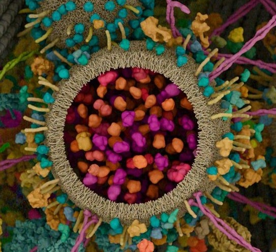

# BECS2 Data Challenge HS21

<!--
*** Thanks for checking out the Best-README-Template. If you have a suggestion
*** that would make this better, please fork the repo and create a pull request
*** or simply open an issue with the tag "enhancement".
*** Don't forget to give the project a star!
*** Thanks again! Now go create something AMAZING! :D
-->

<!-- PROJECT SHIELDS -->
<!--
*** I'm using markdown "reference style" links for readability.
*** Reference links are enclosed in brackets [ ] instead of parentheses ( ).
*** See the bottom of this document for the declaration of the reference variables
*** for contributors-url, forks-url, etc. This is an optional, concise syntax you may use.
*** https://www.markdownguide.org/basic-syntax/#reference-style-links
-->

[![LinkedIn][linkedin-shield]][linkedin-url]

<!-- PROJECT LOGO -->
 

  

<h3 align="center">BECS2 Data Challenge</h3>

  

The aim of the project work is to work independently on a project, which involves researching a topic, analyzing and visualizing data, developing machine learning models with the tool covered in the course (mainly scikit-learn) and discussing the results.

The project can be done by single persons or in teams of up to four people.
    
    *DEADLINE TO HAND IN THE PROJECT WORK: 12.01.2022*

<!--
***     
***    <a href="https://github.com/github_username/repo_name"><strong>Explore the docs »</strong></a>
***     
***     
***    <a href="https://github.com/github_username/repo_name">View Demo</a>
***    ·
***    <a href="https://github.com/github_username/repo_name/issues">Report Bug</a>
***    ·
***    <a href="https://github.com/github_username/repo_name/issues">Request Feature</a>
-->
  

<!-- TABLE OF CONTENTS -->

  
Table of Contents

  <ol>
    <li>
      <a href="#about-the-project">About The Project</a>
      <ul>
        <li><a href="#built-with">Built With</a></li>
      </ul>
    </li>
    <li>
      <a href="#getting-started">Getting Started</a>
      <ul>
        <li><a href="#prerequisites">Prerequisites</a></li>
        <li><a href="#installation">Installation</a></li>
      </ul>
    </li>
    <li><a href="#usage">Usage</a></li>
    <li><a href="#roadmap">Roadmap</a></li>
    <li><a href="#contributing">Contributing</a></li>
    <li><a href="#license">License</a></li>
    <li><a href="#contact">Contact</a></li>
    <li><a href="#acknowledgments">Acknowledgments</a></li>
  </ol>

<!-- ABOUT THE PROJECT -->
## About The Project

Instructions Please take note of the following instructions/guidelines: • Choose a problem that can be solved with the methods discussed in the course.
* Find an appropriate data set for your task. (See e.g. https://archive.ics.uci.edu/ml/ index.php or https://www.kaggle.com/datasets)
* Explain the task to be solved. 
* Point out, possibly, related work or problems in the literature/internet.
* Analyze your data. Visualize and explain the data features you deem to be relevant for the project.
* Explain your approach. That is, explain your model, the model architecture, optimizers, regularization, etc. used.
* Experiment with your model: change it, tune hyperparameters, etc. Do not copy paste a model without substantially adopting it to your problem/task. Explain your final model.
* Show, explain, and visualize your results. 
*  Point out problems encountered. 
*  Point out further work or ideas.
* The code needs to be clearly documented.

Here's a blank template to get started: To avoid retyping too much info. Do a search and replace with your text editor for the following: `github_username`, `repo_name`, `twitter_handle`, `linkedin_username`, `email`, `email_client`, `project_title`, `project_description`

(<a href="#top">back to top</a>)

## Machine learning workflow

#### Define Problem Statement
* Can we predict the health status of a patient by the protein fingerprint?

#### Gather Data
* Avalable

#### Pre-process Data
* Data cleanup
* Data Imputation
* Drop

#### Analyze Data
* Correlations
* Features of importance
* Type of problem

#### Prepare Data
* Transform
* Normalize
* Drop

#### Evaluate Model
* Train/Test
* Classify/Regress
* Feature reduction

#### Tune Model
* Cross validate
* Fine tune parameters / Hyperparamether tuning
* Analyze results

#### Accept / reject Hypothesis

<!-- ABOUT THE Data -->
## About The Data

as an alternative we can use https://www.kaggle.com/piotrgrabo/breastcancerproteomes?select=77_cancer_proteomes_CPTAC_itraq.csv

Read this before working with the data!

the folder data/ includes the following:

### raw.xls
--> raw data which needs to be processed (with python). The size is roughly 550 mb which will end in way less. raw.xls is the raw output from a FAIMS-TOF-MS measurment. 

### tidy.csv
  The processed output of raw.xls. We can already built our model with this file. The features shortly explained
  * R.FileName 	= The sample identifier. Each entry corresponse to an individual patient.
  * uniprot 	= The uniprot accession number of the protein.
  * proteinName	= The protein Name (one Name can have multiple Uniprot numbers but not in this dataset)
  * Group		= The health status of the patients. Is either Healthy or a different kind of cancer.
  * fastaSequence	= The protein Aminoacid sequence. 
  * meanAbu		= The mean Abundance (equivalent to concetration) of each protein. It may varry between patients
  * log10meanAbu	= log10(meanAbu)
  * stdDev		= standard deviation of meanAbu (But is not needed due to the single measurment per patient)
  * relStdDev	= coefficient of variation (relative standardabweichung) of meanAbu (But is not needed due to the single measurment per patient)
  * Rank		= Rank position of the proteins for each patient (Ascending)

### raw2tidy.R 
--> an R script to directly transform raw.xls to tidy.csv. Can be translated into python. Use the package data.table for a super fast read in of raw.xls.
    It may take 1-4 minutes depending on your computer speed

### metadata.csv 
--> is used by raw2tidy.R, includes information about patient, column used etc

### proteinSeqInfoExt.csv
--> is used by raw2tidy.r, includes feature infos about the proteins like sequence, physikochemical etc..

### Built With

* [python](https://www.python.org/)
* [sklearn](https://scikit-learn.org/)

(<a href="#top">back to top</a>)

